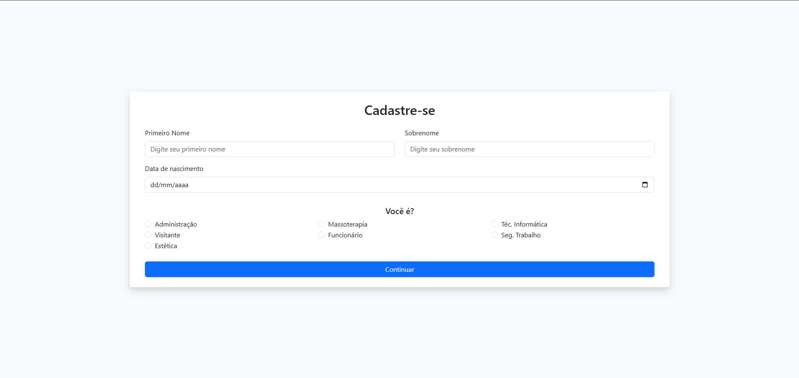
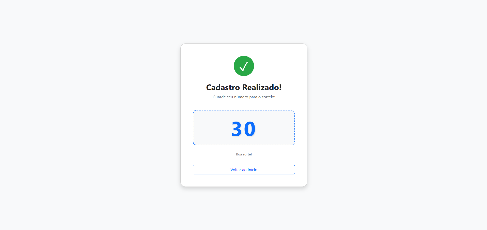

# 🚀 Sistema de Cadastro com Impressão Térmica

<p align="center">
  
</p>

<p align="center">
  
</p>

<p align="center">
  
</p>

<p align="center">
  
  
  
  
</p>

---

## 📌 Sobre o Projeto

Sistema web desenvolvido com **Python + Flask** para cadastro de usuários com integração em **MySQL** e **impressão automática em impressora térmica (i8)**.

Ideal para eventos, recepção de visitantes e sistemas de sorteio.

---

## ✨ Funcionalidades

- ✅ Cadastro de usuários  
- ✅ Armazenamento em banco MySQL  
- ✅ Impressão automática de comprovante  
- ✅ Geração de ID único  
- ✅ Tela de confirmação de cadastro  
- ✅ Tela de sorteio  
- ✅ Interface simples e responsiva  

---

## 🖥️ Telas do Sistema

### 📋 Cadastro
Tela principal onde o usuário insere seus dados.

### ✅ Confirmação
Exibe sucesso após cadastro e dispara a impressão.

### 🎲 Sorteio
Seleciona usuários cadastrados para sorteio.

---

## 🛠 Tecnologias Utilizadas

- Python  
- Flask  
- MySQL  
- HTML / CSS  
- Bootstrap  
- ESC/POS (impressão térmica)  

---

## 📂 Estrutura do Projeto

```bash
tela-de-cadastro/
│
├── .venv/
├── app.py
├── bancodeDados.txt
├── README.md
│
├── templates/
│   ├── index.html
│   ├── sucesso.html
│   └── sorteio.html
│
├── static/
│   ├── css/
│   └── img/
│       ├── cadastro.png
│       ├── sucesso.png
│       └── sorteio.png
⚙️ Pré-requisitos
Antes de rodar o projeto, você precisa ter instalado:

🐍 Python
Python 3.10+

🗄 MySQL Server
MySQL ou MariaDB

🖨 Impressora Térmica i8
Driver instalado no Windows

Nome da impressora configurado corretamente

📦 Instalação das Dependências
Clone o projeto:

git clone https://github.com/seu-usuario/seu-repo.git
cd tela-de-cadastro
Crie e ative o ambiente virtual:

python -m venv .venv

# Windows
.venv\Scripts\activate

# Linux/Mac
source .venv/bin/activate
Instale as dependências:

pip install flask mysql-connector-python python-escpos
🗄 Configuração do Banco de Dados
Execute o script SQL:

CREATE DATABASE cadastro_integrador;

USE cadastro_integrador;

CREATE TABLE usuarios (
    id INT AUTO_INCREMENT PRIMARY KEY,
    primeiro_nome VARCHAR(50),
    sobrenome VARCHAR(100),
    tipo_usuario VARCHAR(50),
    data_nascimento DATE,
    data_cadastro TIMESTAMP DEFAULT CURRENT_TIMESTAMP
);
🖨 Configuração da Impressora Térmica (i8)
Instale o driver da impressora no Windows

Conecte via USB

Vá em:

Painel de Controle > Dispositivos e Impressoras
No código (app.py), configure:

from escpos.printer import Win32Raw

p = Win32Raw("NOME_DA_SUA_IMPRESSORA")
▶️ Como Executar o Projeto
python app.py
Acesse:

http://127.0.0.1:5000
Para acessar a tela de sorteio:

http://127.0.0.1:5000/realizar-sorteio
